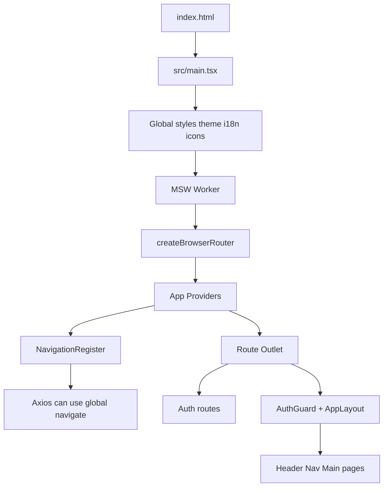

This project is forked from [d3george/slash-admin](https://github.com/d3george/slash-admin) for learning and adaptation.

[简体中文](README.zh-CN.md)

# LT Slash Admin

A React 19, TypeScript, and Vite admin-front-end learning project. Its code is organized around separable, verifiable, and replaceable concerns: routes and navigation, themes and layouts, internationalization, authentication, the request layer, mock APIs, tables, forms, charts, and common UI components.

> [!WARNING]
> This is a learning and adaptation project, not a production-hardened admin template. Browser-side MSW mocks are enabled by default, the `Authorization` value in the request interceptor is only an example, and some pages and data exist solely for demonstrations. Authentication, authorization, API contracts, error handling, and security controls must be redesigned before connecting a real backend.

## Contents

- [Project purpose](#project-purpose)
- [Features and demo scope](#features-and-demo-scope)
- [Technology stack](#technology-stack)
- [Getting started](#getting-started)
- [Configuration](#configuration)
- [Commands](#commands)
- [Architecture](#architecture)
- [Project structure](#project-structure)
- [Core modules](#core-modules)
- [Routing navigation and permissions](#routing-navigation-and-permissions)
- [Data requests and mocks](#data-requests-and-mocks)
- [Theme layout and internationalization](#theme-layout-and-internationalization)
- [Pages and components](#pages-and-components)
- [Development guide](#development-guide)
- [Quality commits and collaboration](#quality-commits-and-collaboration)
- [Current limitations](#current-limitations)
- [Acknowledgements](#acknowledgements)

## Project purpose

The repository is for learning how an admin front end should be structured, not for mechanically copying the upstream project. When changing or adding code, follow this repository's directory responsibilities, component APIs, and rules in `ai/`; use the upstream project only to understand feature intent and interaction boundaries.

Topics covered include nested and lazy React Router routes, route error boundaries, React Query/Zustand/Axios responsibilities, MSW-backed CRUD demos, CSS-variable-based themes, responsive navigation, multi-tabs, i18n, permission rendering, and strict TypeScript types.

## Features and demo scope

| Area              | Included                                                                   | Notes                                                               |
| ----------------- | -------------------------------------------------------------------------- | ------------------------------------------------------------------- |
| Authentication    | Login, registration, password reset, phone, and QR-code pages              | Login is mocked by MSW; other entries mainly demonstrate flows.     |
| Dashboards        | Workbench and Analysis                                                     | Metric cards, charts, projects, members, and transactions.          |
| System management | Menus, roles, and users                                                    | Mock handlers provide in-memory demo data.                          |
| Account center    | Profile and Account                                                        | Profile, teams, projects, connections, security, and notifications. |
| Component demos   | Toasts, icons, i18n, scrolling, charts, animation, uploads                 | Used to explore base APIs and interactions.                         |
| Other pages       | Calendar, Kanban, links, iframe, 403/404/500                               | Local data and navigation/embed examples.                           |
| UX settings       | Theme, palette, fonts, layout, language, responsive navigation, multi-tabs | Settings and login state persist in localStorage.                   |

## Technology stack

| Layer             | Main dependencies                                  | Responsibility                                                           |
| ----------------- | -------------------------------------------------- | ------------------------------------------------------------------------ |
| Runtime and build | Vite 7, TypeScript 5, React 19                     | Development server, production build, strict type checks, runtime.       |
| Routing           | React Router 7                                     | Authentication, layouts, nested routes, redirects, and error boundaries. |
| Server state      | TanStack React Query                               | Async mutations and a future query-cache boundary.                       |
| Client state      | Zustand + persist                                  | User, tokens, and UI settings in localStorage.                           |
| Network           | Axios                                              | Base URL, timeout, response unwrapping, errors, and 401 redirects.       |
| Mocks             | MSW 2, Faker                                       | Browser-intercepted login, menu, role, and user APIs.                    |
| Styling           | Tailwind CSS 4, Vanilla Extract, styled-components | Utility styles, theme tokens, and scoped/third-party styles.             |
| UI                | `src/ui`, Radix UI, Ant Design, Sonner, Iconify    | Controls, tabs, notifications, icons, and interaction primitives.        |

## Getting started

### Prerequisites

- Git;
- A maintained Node.js LTS release compatible with the installed Vite version; the repository does not declare `engines`;
- pnpm. The committed `pnpm-lock.yaml` makes it the preferred package manager.

### Install and run

```bash
git clone https://github.com/LynasTing/lynas-slash-admin.git
cd lynas-slash-admin
pnpm install
pnpm dev
```

The Vite server is fixed to port `5678`; open <http://localhost:5678>. Protected pages redirect to `/auth/login`. The login form pre-fills the first current mock user. Faker creates its password at module load time, so there is no stable documented demo password.

### Production preview

```bash
pnpm build
pnpm preview
```

`build` runs the TypeScript project build before Vite's production build. Use it for changes that can affect output, such as build configuration, dependencies, assets, or route lazy loading; it is not the default check for ordinary documentation or local code edits.

## Configuration

Use [`.env.development`](.env.development) for development and [`.env.production`](.env.production) for production. Application configuration is centralized in [`src/config/global.ts`](src/config/global.ts); business code should use `GLOBAL_CONFIG` instead of accessing `import.meta.env` directly.

| Variable                 | Value        | Meaning                                                                     |
| ------------------------ | ------------ | --------------------------------------------------------------------------- |
| `VITE_APP_DEFAULT_ROUTE` | `/workbench` | Destination after visiting `/` or completing login.                         |
| `VITE_APP_PUBLIC_PATH`   | `/`          | Public path for static assets and the MSW service worker.                   |
| `VITE_APP_API_BASE_URL`  | `/api`       | API prefix for Axios and MSW handlers.                                      |
| `VITE_APP_ROUTER_MODE`   | `frontend`   | `frontend` uses static navigation; `backend` transforms the mock menu tree. |

The development server proxies `/api` to `http://localhost:5678` after removing the prefix. MSW intercepts those requests by default, so no real API is needed. If MSW is disabled, change the proxy target to the real backend.

Before using a real backend: make MSW an explicit development switch; read access tokens from state and implement refresh/expiry/concurrency handling; replace mock contracts; enforce authorization on the server; and review CORS, token/cookie storage, HTTPS, CSP, log redaction, upload validation, and error reporting.

## Commands

| Command                                                | Purpose                                              |
| ------------------------------------------------------ | ---------------------------------------------------- |
| `pnpm dev`                                             | Start Vite development server.                       |
| `pnpm build`                                           | Run TypeScript checks and create a production build. |
| `pnpm preview`                                         | Preview the production build locally.                |
| `pnpm lint`                                            | Run ESLint for JS, JSX, TS, and TSX.                 |
| `pnpm commit`                                          | Start the Commitizen flow.                           |
| `pnpm exec prettier --check README.md README.en-US.md` | Check README formatting.                             |

Dependency installation runs `prepare` to install Husky hooks. `lint-staged` formats Markdown, JSON, CSS, and front-end source with Prettier, and runs ESLint fixes for front-end source at commit time.

## Architecture

### Startup flow



[`src/main.tsx`](src/main.tsx) is the sole browser entry. It loads global styles, themes, and i18n, registers local icons and MSW, then creates the browser router. `App` wraps all routes to share React Query, themes, Toast, and lazy motion features. `NavigationRegister` runs inside `RouterProvider` so Axios can redirect after a 401 without illegally calling a React Hook in the request layer.

### Layers and dependency direction

```text
pages / layout / components / ui
              ↓
      store + hooks + locales
              ↓
     api/services → utils/request
              ↓
       MSW handlers or real backend

config / constants / types / theme / assets
```

Pages compose business interactions; layouts own the admin shell; `components` are reusable and business-agnostic; `ui` is the base control layer. Services describe typed API calls, `utils/request.ts` owns transport concerns, and React Query should own server state. Shared foundation modules must not depend on page business modules.

## Project structure

```text
.
├── ai/                    # Project rules, workflow, and context
├── public/                # MSW browser service worker
├── src/
│   ├── _mock/             # MSW worker, handlers, in-memory demo data
│   ├── api/services/      # Domain API services
│   ├── assets/            # Images, SVG icons, global styles
│   ├── components/        # Reusable components
│   ├── config/            # Normalized application configuration
│   ├── constants/         # Stable business constants
│   ├── hooks/             # Cross-component hooks
│   ├── layout/            # App/simple layouts and header
│   ├── locales/           # i18next setup and language resources
│   ├── pages/             # Route-domain pages
│   ├── router/            # Routes, guards, navigation registration
│   ├── store/             # Zustand user and setting state
│   ├── theme/             # Tokens, CSS variables, theme provider
│   ├── types/             # Shared entities and API types
│   ├── ui/                # Base UI controls
│   └── utils/             # Requests, storage, tree and format helpers
├── .env.development
├── .env.production
├── README.md              # Simplified Chinese documentation
├── README.en-US.md        # English documentation
└── package.json
```

Page domains include `auth`, `dashboard`, `management`, `components`, `functions`, `others`, `menu-level`, and `sys/error`.

## Core modules

`src/App.tsx` assembles `QueryClientProvider`, `ThemeProvider`, `Toast`, and `MotionLazy`; it dynamically imports `react-scan` in development and currently shows only its toolbar. Add global providers here rather than repeatedly creating global clients in page components.

`tsconfig.json` enables strict checks including `noImplicitAny`, `noUnusedLocals`, and `noUnusedParameters`. It maps `@/*` to `src/*` and `#/*` to `src/types/*`; `vite-tsconfig-paths` uses the same aliases.

Use `src/ui` for reusable primitives, `src/components` for composed reusable capabilities, `src/layout` for the admin shell, and `src/pages` for business composition.

## Routing navigation and permissions

[`src/router/index.tsx`](src/router/index.tsx) combines authentication routes (`/auth/*`), guarded application routes under `AppLayout`, and error routes (403/404/500). The root route redirects to `GLOBAL_CONFIG.defaultRoute`; page modules are found through `import.meta.glob('/src/pages/**/*.tsx')` and cached via `getLazyComponent`.

`GetFrontendRoutes()` currently produces all page routes. `VITE_APP_ROUTER_MODE` changes navigation data only: `frontend` reads static navigation and `backend` transforms mock `DB_MENU`. It is not dynamic backend routing. A real implementation must map constrained backend page identifiers through a trusted front-end whitelist, never import arbitrary strings.

The route-level `auth-guard.tsx` redirects when no Zustand `accessToken` exists. The component-level guard renders by single/any/all permissions and roles. These are UX controls only; the backend must protect resources.

To add a page: create it under `src/pages/<domain>/<feature>/`; add its route and any index redirect; add static navigation with i18n keys; add matching English and Chinese language resources; add a typed service and mock handler when needed; then validate route, navigation, permission, and 404 behavior together.

## Data requests and mocks

The intended chain is:

```text
Page event → React Query/page mutation → api/services → utils/request → MSW handler or real API
```

[`src/utils/request.ts`](src/utils/request.ts) owns the API prefix, 10-second timeout, JSON header, demonstration authorization value, `{ status, message, data }` response unwrapping, error notifications, and 401 logout/redirect. Pages must call typed service functions rather than compose API URLs or Axios configuration themselves.

MSW is started in `src/main.tsx` and registered through `src/_mock/index.ts`. Mock data is session memory: reloads or restarts can discard CRUD changes, and Faker values are not stable fixtures. Use fixed fixtures or a seed for deterministic tests.

## Theme layout and internationalization

Theme tokens are in `src/theme/tokens/`; `ThemeProvider` writes theme mode, palette, font size, and font family to the document. `src/store/setting.ts` persists theme, layout, breadcrumb, multi-tab, sidebar, and direction settings.

`AppLayout` uses a media query for mobile layouts. Desktop supports vertical, horizontal, and Mini navigation; mobile navigation moves into the header. Reuse existing settings tokens and CSS variables instead of hard-coding shell dimensions or colors in pages.

i18n initializes in [`src/locales/i18n.ts`](src/locales/i18n.ts), with resources in `en_US/jsons` and `zh_CN/jsons`. The stored language is preferred and `en_US` is the fallback. Every new visible string needs matching English and Chinese resources.

## Pages and components

- `dashboard/workbench` and `dashboard/analysis`: dashboard and analytics examples.
- `management/user/{profile,account}`: personal settings; `management/system/{menu,role,user}`: management demos.
- `components/{toast,icon,multi-language,scroll,chart,animate,upload}`: component playground pages.
- `others/calendar`, `others/kanban`, and `others/link/*`: calendar, drag-and-drop Kanban, iframe, and external-link demos.
- `functions/token-expired`: 401, authentication cleanup, and login-redirect demo.

## Development guide

For a new API, keep the one-way flow shown above. Services export typed input and output; transform UI-specific shapes at the service or mock boundary. For a new mock API, define the typed service, implement matching HTTP handlers, register them in `_mock/index.ts`, return `{ status, message, data }`, and handle duplicate/missing-target errors for mutable data.

Put cross-domain primitives in `src/ui`, composed reusable capabilities in `src/components`, and single-page views next to their page. Extract a Hook only when the logic is complex and truly reusable. Prefer explicit types; use `as const` objects/arrays for new closed value sets, and do not extend legacy `enum` use without a runtime or third-party need.

Comments should explain non-obvious intent, not translate code. Avoid trailing comments. In this i18n project, write complete Chinese comments first and complete English comments second, with matching meaning.

## Quality commits and collaboration

Read and follow these before changing code:

- [`ai/rules/code-style-ai.md`](ai/rules/code-style-ai.md)
- [`ai/rules/git-commit-message.md`](ai/rules/git-commit-message.md)
- [`ai/workflow/pr-review-flow.md`](ai/workflow/pr-review-flow.md)
- [`ai/project-context.md`](ai/project-context.md)

For README-only changes, run Prettier against the affected files; builds are generally unnecessary. Use `pnpm lint` and targeted type checks/tests for local front-end changes. Run `pnpm build` for cross-module, build-config, dependency, asset, or production-output changes.

Commit headers use Conventional Commits: `<type>(<scope>): <subject>`. For multi-part commits, write the complete English body first, leave one blank line, then write the complete Chinese body. Do not include unrelated changes in the same commit.

## Current limitations

| Current state                     | Impact                                                  | Recommended change                                                                      |
| --------------------------------- | ------------------------------------------------------- | --------------------------------------------------------------------------------------- |
| MSW starts unconditionally        | Demo APIs can hide real integration failures.           | Control it with an explicit environment variable.                                       |
| Fixed example authorization       | It cannot authenticate production users.                | Read state tokens and implement refresh, revocation, expiry, and concurrency handling.  |
| User state in localStorage        | Convenient for demos, insufficient as a security model. | Evaluate httpOnly cookies, XSS mitigation, and persistence scope.                       |
| `backend` only changes navigation | Dynamic menus and routes are not integrated.            | Build a controlled component whitelist, menu contract, and route-registration strategy. |
| Guards and navigation filtering   | They only control visibility.                           | Enforce permissions in the API service.                                                 |
| Faker-generated mock data         | Some data and passwords are unstable.                   | Use fixed fixtures or a seed for tests.                                                 |
| Overlapping dependencies          | They increase long-term styling and API complexity.     | Consolidate UI, styling, and motion choices before productization.                      |

## Acknowledgements

- Upstream: [d3george/slash-admin](https://github.com/d3george/slash-admin)
- This repository: [LynasTing/lynas-slash-admin](https://github.com/LynasTing/lynas-slash-admin)
- Third-party dependency licenses are defined in their respective repositories and published packages.

This repository does not currently include a separate `LICENSE` file. Confirm upstream and dependency license requirements and add an explicit license before redistribution, commercial use, or reuse.

> Note: The current README documentation was generated by AI.
