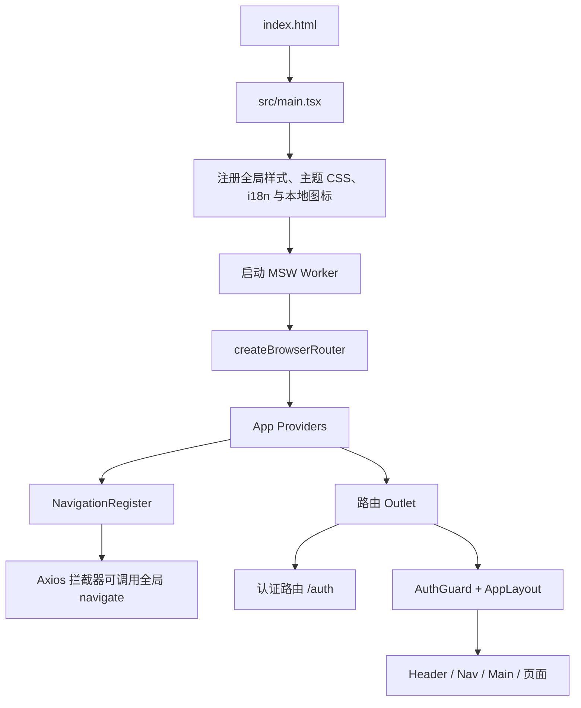
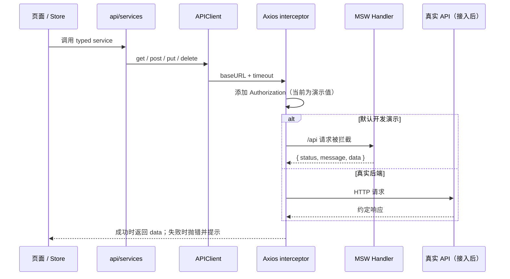

本项目 fork 自 [d3george/slash-admin](https://github.com/d3george/slash-admin)，主要用于学习。

[English](README.md)

# LT Slash Admin

一个以 React 19、TypeScript 和 Vite 构建的后台管理前端学习项目。项目围绕“可拆解、可验证、可替换”的后台前端能力组织代码：路由和导航、主题与布局、多语言、鉴权、请求层、Mock 接口、表格表单、图表与常用 UI 组件均有对应实现。

> [!WARNING]
> 这是学习与改造工程，不是已经完成安全加固的生产后台模板。当前默认启用浏览器端 MSW Mock；请求拦截器中的 `Authorization` 仍是示例值；部分页面和数据仅用于演示。接入真实后端前，必须完成认证、授权、接口契约、错误处理和安全策略改造。

## 目录

- [项目定位](#项目定位)
- [功能与演示范围](#功能与演示范围)
- [技术栈](#技术栈)
- [快速开始](#快速开始)
- [配置说明](#配置说明)
- [命令速查](#命令速查)
- [架构设计](#架构设计)
- [目录结构](#目录结构)
- [核心模块说明](#核心模块说明)
- [路由、导航与权限](#路由导航与权限)
- [数据请求与 Mock](#数据请求与-mock)
- [主题、布局与国际化](#主题布局与国际化)
- [页面与组件范围](#页面与组件范围)
- [开发指南](#开发指南)
- [质量、提交与协作规范](#质量提交与协作规范)
- [当前限制与改造建议](#当前限制与改造建议)
- [致谢与来源](#致谢与来源)

## 项目定位

本仓库的目标是学习后台前端的结构设计，而不是机械复制上游项目。改造和新增代码时，以当前仓库的目录职责、组件 API 与 `ai/` 中的规范为准；上游项目仅用于理解功能意图和交互边界。

适合用来学习的主题包括：

- React Router 的嵌套路由、懒加载、默认重定向和路由级错误边界；
- React Query、Zustand 与 Axios 在“服务层—状态层—页面层”中的职责划分；
- MSW 如何让前端在没有后端服务时仍能演示登录与管理类 CRUD；
- 基于 CSS Variables、Vanilla Extract、Tailwind CSS 和 UI 组件的主题系统；
- 多布局导航、响应式界面、多标签页、国际化与权限显示；
- 在严格 TypeScript 配置下组织业务类型、接口类型和 UI 类型。

## 功能与演示范围

| 类别     | 已有内容                                             | 说明                                                             |
| -------- | ---------------------------------------------------- | ---------------------------------------------------------------- |
| 认证入口 | 登录、注册、重置密码、手机号、二维码页面             | 登录通过 MSW 模拟；其他入口主要用于页面流程演示。                |
| 工作台   | Workbench、分析看板                                  | 包含指标卡、图表、项目、成员、交易等展示组件。                   |
| 系统管理 | 菜单、角色、用户管理                                 | 用户、角色和菜单请求由 Mock Handler 支持；具体演示数据存于内存。 |
| 个人中心 | Profile、Account                                     | 提供资料、团队、项目、连接、安全与通知等界面。                   |
| 组件示例 | Toast、图标、国际化、滚动、图表、动画、上传          | 用于验证和学习底层组件的 API 与交互。                            |
| 其他页面 | 日历、看板、外链、iframe、403/404/500                | 日历和看板含本地模拟数据；外链页面用于展示嵌入与跳转边界。       |
| 体验能力 | 深浅色、配色、字体、布局、语言、响应式导航、多标签页 | 用户设置与登录状态通过 localStorage 持久化。                     |

## 技术栈

| 层级         | 主要依赖                                             | 在本项目中的职责                                           |
| ------------ | ---------------------------------------------------- | ---------------------------------------------------------- |
| 运行与构建   | Vite 7、TypeScript 5、React 19                       | 提供开发服务器、生产构建、严格类型检查和应用运行时。       |
| 路由         | React Router 7                                       | 组织认证页、应用布局页、嵌套路由、重定向和错误边界。       |
| 服务端状态   | TanStack React Query                                 | 封装登录等异步 mutation，并为后续查询缓存留出统一入口。    |
| 客户端状态   | Zustand + persist                                    | 保存用户信息、令牌与界面设置；状态持久化到 localStorage。  |
| 网络层       | Axios                                                | 统一 API 基地址、超时、响应解包、错误提示和 401 跳转。     |
| Mock         | MSW 2、Faker                                         | 在浏览器中拦截请求，提供登录、菜单、角色和用户等演示接口。 |
| 样式与主题   | Tailwind CSS 4、Vanilla Extract、styled-components   | 分别处理原子化样式、主题 token 和部分第三方/局部样式封装。 |
| UI 与交互    | 自研 `src/ui`、Radix UI、Ant Design、Sonner、Iconify | 提供基础控件、Tabs、提示、图标和交互能力。                 |
| 表单与校验   | React Hook Form、Zod                                 | 管理表单状态和校验边界。                                   |
| 可视化与动效 | ApexCharts、FullCalendar、dnd-kit、Framer Motion     | 支撑仪表盘图表、日历、看板拖拽和动画示例。                 |
| 国际化       | i18next、react-i18next                               | 提供 `en_US` 与 `zh_CN` 语言资源及语言切换能力。           |

## 快速开始

### 前置条件

- 已安装 Git；
- 已安装 Node.js。仓库没有声明 `engines` 字段，建议使用与当前 Vite 版本兼容的维护中 Node.js LTS；
- 已安装 pnpm。仓库提交了 `pnpm-lock.yaml`，因此应优先使用 pnpm，避免锁文件漂移。

### 安装与启动

```bash
git clone https://github.com/LynasTing/lynas-slash-admin.git
cd lynas-slash-admin
pnpm install
pnpm dev
```

开发服务器由 `vite.config.ts` 固定在 `5678` 端口。启动成功后访问：<http://localhost:5678>。

首次打开受保护页面会被路由守卫导向 `/auth/login`。登录表单默认填入当前 Mock 数据的第一位用户，直接提交即可体验；密码由 Faker 在每次模块加载时动态生成，因此不存在可写死在文档中的稳定演示密码。

### 生产预览

```bash
pnpm build
pnpm preview
```

`build` 会先执行 TypeScript project build，再执行 Vite 生产构建。它适用于构建配置、依赖、资源处理、路由懒加载等可能影响产物的变更；普通文档或局部代码调整不应把它当成默认检查。

## 配置说明

环境变量文件为开发环境的 [`.env.development`](.env.development) 和生产环境的 [`.env.production`](.env.production)，应用配置集中在 [`src/config/global.ts`](src/config/global.ts)。业务代码应优先读取 `GLOBAL_CONFIG`，不应在各处直接读取 `import.meta.env`。

| 变量                     | 当前值       | 含义                                                                              |
| ------------------------ | ------------ | --------------------------------------------------------------------------------- |
| `VITE_APP_DEFAULT_ROUTE` | `/workbench` | 访问根路径或登录成功后的默认跳转地址。                                            |
| `VITE_APP_PUBLIC_PATH`   | `/`          | 静态资源和 MSW Service Worker 的公共路径。                                        |
| `VITE_APP_API_BASE_URL`  | `/api`       | Axios 与 MSW Handler 使用的 API 前缀。                                            |
| `VITE_APP_ROUTER_MODE`   | `frontend`   | 选择导航数据来源：`frontend` 使用静态导航，`backend` 使用 Mock 菜单树转换的导航。 |

开发服务器将 `/api` 代理到 `http://localhost:5678` 并移除 `/api` 前缀。默认情况下，请求会先被 MSW 拦截，因此不需要真实 API 服务。关闭或移除 MSW 后，才会进入该代理链路；届时必须把代理目标改为真实后端地址。

### 接入真实后端前的最小改造清单

1. 让 [`src/main.tsx`](src/main.tsx) 仅在明确的开发开关下启动 MSW，而不是无条件 `worker.start()`。
2. 将 [`src/utils/request.ts`](src/utils/request.ts) 中的固定 `Bearer Token` 改为从用户状态读取 access token，并设计刷新、失效和并发请求策略。
3. 以真实接口契约替换 `src/_mock/handlers/` 与 `src/_mock/_backup.ts`，统一响应码、分页、错误码与权限字段。
4. 在服务端执行真正的身份验证与权限校验。前端导航过滤和条件渲染只改善体验，不构成安全边界。
5. 检查跨域、Cookie/Token 存储、HTTPS、CSP、日志脱敏、上传校验和错误上报策略。

## 命令速查

| 命令                                   | 用途                                             |
| -------------------------------------- | ------------------------------------------------ |
| `pnpm dev`                             | 启动 Vite 开发服务器。                           |
| `pnpm build`                           | 执行 TypeScript 检查并生成生产构建。             |
| `pnpm preview`                         | 本地预览生产构建结果。                           |
| `pnpm lint`                            | 使用 ESLint 检查 JS、JSX、TS 与 TSX 文件。       |
| `pnpm commit`                          | 启动 Commitizen 交互式提交。                     |
| `pnpm exec prettier --check README.md` | 仅检查 README 的格式，适合文档修改后的快速验证。 |

安装依赖时会执行 `prepare`，通过 Husky 安装 Git hooks。`lint-staged` 会在提交阶段对 Markdown、JSON、CSS 与前端源码执行 Prettier，并对前端源码执行 ESLint 自动修复。

## 架构设计

### 应用启动链路



[`src/main.tsx`](src/main.tsx) 是唯一的浏览器入口：先加载全局样式、主题和国际化，再注册本地图标和 MSW，最后创建 Browser Router。根路由用 `App` 包裹全部页面，以便所有页面共享 React Query、主题、Toast 和动效懒加载能力。

`NavigationRegister` 必须渲染在 `RouterProvider` 内部。它将 `useNavigate()` 注册给路由组件树之外的逻辑，因此 Axios 在收到 401 时能清空用户状态并跳回登录页，而不需要在请求层错误地调用 React Hook。

### 分层与依赖方向

```text
pages / layout / components / ui
              │
              ▼
      store + hooks + locales
              │
              ▼
     api/services → utils/request
              │
              ▼
       MSW handlers 或真实后端

config / constants / types / theme / assets
        └── 为上层提供共享定义，不依赖页面业务
```

- `pages` 负责具体页面组合和用户交互；页面不应自行散落请求 URL。
- `layout` 负责后台壳、导航、头部、面包屑与多标签页，不承载具体业务页面逻辑。
- `components` 是可跨页面复用的业务无关组件；`ui` 是更底层的基础控件封装。
- `api/services` 仅描述接口路径、请求载荷和响应类型；`utils/request.ts` 负责传输层共性。
- `store` 保存跨页面客户端状态；服务端请求状态优先交给 React Query。
- `types`、`constants`、`config` 和 `theme` 是共享基础层，应避免反向引用页面模块。

## 目录结构

```text
.
├── ai/                              # 项目规则、工作流和项目上下文
│   ├── project-context.md
│   ├── rules/
│   └── workflow/
├── public/
│   └── mockServiceWorker.js          # MSW 浏览器端 Service Worker
├── src/
│   ├── _mock/                        # MSW worker、handler 与内存演示数据
│   ├── api/services/                 # 按领域拆分的接口服务
│   ├── assets/                       # 图片、SVG 图标与全局样式
│   ├── components/                   # 可复用组件：鉴权、图标、导航、上传等
│   ├── config/                       # 从环境变量归一化得到的全局配置
│   ├── constants/                    # 稳定业务常量
│   ├── hooks/                        # 跨组件复用的 Hook
│   ├── layout/                       # App 布局、Simple 布局及头部组件
│   ├── locales/                      # i18next 初始化与中英文资源
│   ├── pages/                        # 按路由领域组织的页面实现
│   ├── router/                       # 路由表、守卫、导航注册与路由工具
│   ├── store/                        # Zustand 用户与设置状态
│   ├── theme/                        # token、CSS Variables、主题 Provider
│   ├── types/                        # 实体、API、枚举等共享类型
│   ├── ui/                           # 基础 UI 控件及其样式封装
│   ├── utils/                        # request、存储、树结构、格式化等工具
│   ├── App.tsx                       # 应用级 Provider 组合
│   └── main.tsx                      # 浏览器入口和 Router 启动
├── .env.development                  # 开发环境变量
├── eslint.config.js                  # ESLint flat config
├── vite.config.ts                    # Vite 插件、端口与开发代理
├── tsconfig.json                     # 严格 TypeScript 与路径别名
└── package.json                      # 命令、依赖、Commitizen 与 lint-staged
```

### 页面领域

| 目录               | 主要内容                                                       |
| ------------------ | -------------------------------------------------------------- |
| `pages/auth`       | 登录、注册、重置、手机号和二维码认证界面，以及认证页局部状态。 |
| `pages/dashboard`  | Workbench 和 Analysis 两个仪表盘页面及其拆分组件。             |
| `pages/management` | 用户资料、账号设置、系统菜单、角色和用户管理。                 |
| `pages/components` | Toast、图标、语言、滚动、图表、动画和上传的演示页。            |
| `pages/functions`  | 剪贴板与 Token 过期等功能示例。                                |
| `pages/others`     | 日历、看板、iframe 与外链示例。                                |
| `pages/menu-level` | 多层嵌套菜单和路由示例。                                       |
| `pages/sys/error`  | 403、404、500 页面与通用错误布局。                             |

## 核心模块说明

### 应用级 Provider

[`src/App.tsx`](src/App.tsx) 按以下顺序组合基础能力：

1. `QueryClientProvider`：提供 React Query 客户端；
2. `ThemeProvider`：将主题模式、配色、字体和字号同步到根 DOM；
3. `Toast`：挂载 Sonner 通知容器；
4. `MotionLazy`：按需加载 Framer Motion 相关能力；
5. 开发环境下动态导入 `react-scan`，当前配置为不启用扫描，仅显示工具栏。

新增全局 Provider 时，应在这里集中挂载，并确认它是否必须位于路由上下文内或主题上下文内。不要在单个页面反复创建全局客户端实例。

### 配置与路径别名

TypeScript 的 [`tsconfig.json`](tsconfig.json) 开启了 `strict`、`noImplicitAny`、`noUnusedLocals` 和 `noUnusedParameters` 等检查，并定义：

| 别名  | 指向          | 适用范围                     |
| ----- | ------------- | ---------------------------- |
| `@/*` | `src/*`       | 应用模块、组件、样式和工具。 |
| `#/*` | `src/types/*` | API、实体和枚举等类型定义。  |

Vite 使用 `vite-tsconfig-paths` 读取同一份别名，避免开发环境和类型检查的解析规则不一致。

### UI 层

- `src/ui`：Button、Input、Dialog、Form、Table、Tabs 等底层控件及其样式。优先在这里统一可复用基础 API，而不是在页面中复制控件外观。
- `src/components`：由 `ui` 组合出的中层组件，例如图标、导航、上传、图表、Toast、权限守卫和动画。
- `src/layout`：仅处理后台壳。桌面端根据设置切换水平、垂直或 Mini 布局；移动端改用顶部 Header 与移动导航。
- `src/pages`：组合业务场景。跨页面复用的逻辑或视图应向下抽到 `components`，而不是让一个页面目录变成公共组件仓库。

## 路由、导航与权限

### 路由结构

根路由由 [`src/router/index.tsx`](src/router/index.tsx) 汇总三类路由：

| 路由组   | 来源                        | 作用                                                 |
| -------- | --------------------------- | ---------------------------------------------------- |
| 认证路由 | `router/sections/auth`      | `/auth/*` 下的登录、注册、重置、手机号和二维码页面。 |
| 应用路由 | `router/sections/dashboard` | 被登录守卫和 `AppLayout` 包裹的后台页面。            |
| 错误路由 | `router/sections/sys/error` | 403、404、500 等错误页面。                           |

应用根路径会重定向到 `GLOBAL_CONFIG.defaultRoute`。业务页面以 `import.meta.glob('/src/pages/**/*.tsx')` 建立可加载模块表，再通过 `getLazyComponent` 缓存 `React.lazy` 组件，实现路径字符串到页面模块的懒加载映射。

### 静态路由模式与导航模式

当前路由表实际由 `GetFrontendRoutes()` 生成，包含 workbench、analysis、functions、management、components、others 和 menu-level 等静态前端路由。

`VITE_APP_ROUTER_MODE` 目前只影响导航数据：

- `frontend`：使用 [`nav-data/frontend.tsx`](src/layout/app/nav/nav-data/frontend.tsx) 中维护的静态导航；
- `backend`：使用 Mock `DB_MENU` 经过“扁平数组 → 菜单树 → 导航分组”转换后的导航。

因此，`backend` 不是完整的后端动态路由实现。切换该值不会根据后端菜单自动注册路由，也不会保证菜单与完整页面路由一一对应。这是当前学习代码的明确边界，后续若要实现动态路由，应让后端返回受约束的页面标识，再在可信的前端白名单中映射组件，绝不能将任意字符串直接导入执行。

### 登录与访问控制

路由级 [`router/components/auth-guard.tsx`](src/router/components/auth-guard.tsx) 读取 Zustand 中的 `accessToken`；不存在 token 时跳转 `/auth/login`。用户信息、access token 和 refresh token 通过 Zustand `persist` 写入 localStorage。

组件级 [`components/auth/auth-guard.tsx`](src/components/auth/auth-guard.tsx) 提供单个/任一/全部权限与角色的条件渲染，`useAuthCheck` 将权限和角色转换为 `Set` 以进行快速查询。导航数据也会按 `auth` 字段筛选。

这些机制只负责前端体验：隐藏菜单、禁用或不渲染按钮、阻止未登录访问。真正的资源访问控制必须在后端完成。

### 新增页面的推荐步骤

1. 在对应领域的 `src/pages/<domain>/<feature>/index.tsx` 创建页面；
2. 在 [`router/sections/dashboard/frontend.tsx`](src/router/sections/dashboard/frontend.tsx) 增加路由，并为目录入口设计必要的 `Navigate` 重定向；
3. 在 `layout/app/nav/nav-data/frontend.tsx` 增加导航项，使用 i18n key 而不是直接散落文案；
4. 在 `src/locales/lang/en_US/jsons/` 与 `src/locales/lang/zh_CN/jsons/` 补齐相同语义的翻译；
5. 如果页面需要接口，在 `api/services` 增加服务层；如果仍使用演示环境，在 `_mock/handlers` 增加同路径 Handler；
6. 检查路由、导航、权限条件和 404 边界是否一致。

## 数据请求与 Mock

### 请求链路



[`src/utils/request.ts`](src/utils/request.ts) 创建唯一的 Axios 实例，负责：

- 使用 `GLOBAL_CONFIG.apiBaseUrl` 作为统一前缀，超时为 10 秒；
- 请求前设置 JSON Content-Type 和示例 Authorization Header；
- 将 `{ status, data, message }` 格式的成功响应解包为 `data`；
- 将业务失败转为 `Error`，并由 Sonner 显示请求错误；
- 在 HTTP 401 时清空用户认证状态，并通过已注册的全局导航回到登录页。

服务文件按资源领域拆分，例如 `api/services/auth.ts`、`menu.ts`、`role.ts` 和 `user.ts`。页面应调用服务函数，不应自行拼接 `/api/...` 字符串或手写 Axios 配置。

### Mock 机制与数据生命周期

[`src/main.tsx`](src/main.tsx) 在启动时调用 `worker.start()`，[`src/_mock/index.ts`](src/_mock/index.ts) 将认证、菜单、角色和用户 Handler 注册到 MSW。Handler 使用与真实服务层相同的 API 路径，从而保证页面调用方式不因 Mock 存在而变化。

Mock 数据存在浏览器当前运行会话的内存中：刷新页面、重新加载模块或重启开发服务器后，CRUD 修改可能消失。部分初始值由 Faker 生成，因此 ID、头像和密码等并非稳定测试夹具。需要稳定端到端测试时，应提供固定 seed 或独立 fixture，不要依赖当前默认登录表单的随机密码。

### 接口响应约定

当前请求层期待如下包裹结构：

```ts
type ApiResponse<T> = {
  status: number;
  message: string;
  data: T;
};
```

成功状态由 `ResultStatusEnum.SUCCESS`（当前为 `0`）表示；非成功业务状态会被转换为异常。真实后端若使用不同字段、HTTP 状态或分页结构，应优先调整服务契约和请求转换层，而不是在每一个页面单独兼容。

## 主题、布局与国际化

### 主题与设置

主题 token 位于 `src/theme/tokens/`，主题变量由 `src/theme/theme.css.ts` 生成。`ThemeProvider` 监听设置状态，并把以下信息写入 `<html>` 或 `<body>`：

- `data-theme-mode`：浅色或深色模式；
- `data-color-palette`：主题配色；
- `font-size` 和 `font-family`：全局字号与字体。

`src/store/setting.ts` 持久化主题模式、配色、字体、字号、布局、面包屑、多标签页、侧栏深色模式和文档方向等设置。Header 中的设置面板是这些状态的主要交互入口。

### 响应式布局

`AppLayout` 用 `useMediaQuery(down('md'))` 判断移动端：

- 桌面端：按设置渲染垂直、水平或 Mini 导航；
- 移动端：使用 Header 承载移动导航，主内容区不保留桌面侧栏；
- Header：集中承载搜索、语言、通知、设置与账户菜单；
- Main：承载页面 Outlet，并在启用时组合多标签页能力。

布局切换应依赖已有设置 token 与 CSS 变量，避免在业务页面硬编码侧栏宽度、Header 高度或颜色值。

### 国际化

国际化在 [`src/locales/i18n.ts`](src/locales/i18n.ts) 初始化。语言资源按语言和业务 JSON 分割：

```text
src/locales/lang/
├── en_US/jsons/{auth,common,dashboard,pages,sys,ui}.json
└── zh_CN/jsons/{auth,common,dashboard,pages,sys,ui}.json
```

默认语言优先读取 localStorage 中保存的语言设置，缺失时回退到 `en_US`。新增可见文本时，应同时更新中英文资源；不要在导航、页面和请求错误处理里混用难以维护的硬编码文案。

## 页面与组件范围

### Dashboard

- `dashboard/workbench`：项目概览、收益、交易、成员与进度等组合示例；
- `dashboard/analysis`：流量、趋势、渠道、页面、设备和 Web Analytics 图表组合。

### Management

- `management/user/profile` 与 `management/user/account`：个人资料、项目、团队、连接、通知和安全配置界面；
- `management/system/menu`：菜单数据编辑演示；
- `management/system/role`：角色数据管理演示；
- `management/system/user`：用户列表、创建、编辑和删除，配合 `api/services/user.ts` 与 Mock Handler 演示 CRUD 数据链路。

### Component playground

- `components/toast`：通知能力；
- `components/icon`：本地图标和 Iconify 图标；
- `components/multi-language`：语言切换；
- `components/scroll`：滚动条和滚动进度；
- `components/chart`：ApexCharts 柱状、折线、面积、饼图、雷达、混合等图表；
- `components/animate`：进入视口、滚动和背景动画；
- `components/upload`：头像、拖拽和文件上传控件。

### Other pages

- `others/calendar`：FullCalendar 视图和事件编辑演示；
- `others/kanban`：dnd-kit 驱动的看板与任务抽屉；
- `others/link/iframe` 与 `others/link/external`：外部页面嵌入与新窗口跳转；
- `functions/token-expired`：401、清理认证状态和登录跳转链路的演示入口。

## 开发指南

### 新增接口

推荐保持下面的单向职责：

```text
页面事件
  → React Query / 页面 mutation
  → api/services/<resource>.ts
  → utils/request.ts
  → MSW Handler 或真实 API
```

服务层函数应导出明确的请求参数和响应类型；UI 表单提交结构与实体存储结构不同的时候，在服务端或 Mock Handler 的边界做转换。用户管理中 `roleIds` 转换为完整 `roles` 的处理就是该原则的示例。

### 新增 Mock 接口

1. 在 `api/services` 先声明路径常量与 typed service；
2. 在 `_mock/handlers` 实现同一路径的 `http.get`、`post`、`put` 或 `delete` Handler；
3. 在 `_mock/index.ts` 注册 Handler；
4. 返回与请求层相符的 `{ status, message, data }`；
5. 明确数据是只读 fixture 还是可变内存数据，并处理重复、缺失目标等失败分支。

### 新增组件

- 可跨领域复用的基础控件放入 `src/ui`；
- 由基础控件组合、但不属于具体页面的能力放入 `src/components`；
- 只服务一个页面的简单局部视图，留在该页面目录；
- Hook 只在逻辑复杂且具有真实复用价值时抽取，且必须以 `use` 开头；
- 不要为只调用一次的简单表达式制造工具函数或跨文件跳转。

### 类型与常量

- 优先使用明确的 TypeScript 类型，项目已启用严格检查；
- 稳定、封闭、可枚举的值集合使用 `as const` 对象或数组并推导联合类型；
- 集中常量模块导出的稳定枚举式集合采用全大写、下划线和 `_MAP` 后缀；
- 普通配置对象、标签映射、局部选项使用语义化小驼峰；
- 当前仓库仍存在历史 `enum`，新增实现不要扩大这种历史用法，除非确有运行时枚举 API 或第三方接口约束。

### 注释与可读性

复杂数据处理、多步骤流程、条件分支、递归或不直观逻辑应解释“为什么这样做”。注释不要逐行翻译代码，也不要使用行尾注释。i18n 项目的新增注释遵循“完整中文在前、完整英文在后”的分层表达，二者语义必须一致。

## 质量、提交与协作规范

提交代码前必须先阅读并遵守：

- [`ai/rules/code-style-ai.md`](ai/rules/code-style-ai.md)：TypeScript、命名、模块拆分、注释和代码风格规则；
- [`ai/rules/git-commit-message.md`](ai/rules/git-commit-message.md)：Commit message 生成规则；
- [`ai/workflow/pr-review-flow.md`](ai/workflow/pr-review-flow.md)：格式化、Lint、类型检查和构建检查策略；
- [`ai/project-context.md`](ai/project-context.md)：上游参考与当前仓库优先级。

### 本地检查建议

| 变更类型                         | 首选检查                                        | 何时增加构建检查                     |
| -------------------------------- | ----------------------------------------------- | ------------------------------------ |
| 仅 README、文案或局部样式        | 对目标文件执行 Prettier 检查                    | 通常不需要。                         |
| 局部 TS/TSX 逻辑                 | `pnpm lint`，必要时 TypeScript 检查或针对性测试 | 路由懒加载、资源加载受影响时。       |
| 跨模块、构建配置、依赖或资源改动 | Lint、类型检查及相关测试                        | 必须执行 `pnpm build` 验证生产链路。 |

不要为了很小的改动默认运行构建；同样也不要用“只跑了格式化”掩盖高风险改动。检查范围应与风险匹配。

### 提交信息

仓库使用 `@commitlint/config-conventional`。提交 header 格式：

```text
<type>(<scope>): <subject>
```

README 改动的示例：

```text
docs(readme): document project architecture and development workflow
```

当改动超过两个独立点时，提交正文先写完整英文说明，再空一行写完整中文说明；不要把不相关改动塞进同一提交。

## 当前限制与改造建议

以下内容是根据当前仓库代码可直接观察到的边界，不应在接入真实业务时忽略：

| 现状                         | 影响                                                      | 建议                                                         |
| ---------------------------- | --------------------------------------------------------- | ------------------------------------------------------------ |
| `main.tsx` 无条件启动 MSW    | 默认运行的是浏览器端演示接口，可能遮蔽真实 API 集成问题。 | 用显式环境变量控制 Mock，仅在开发/演示环境启用。             |
| Authorization 使用固定示例值 | 不会携带真实登录态，不能用于生产认证。                    | 从状态读取 token，补充刷新、撤销、过期和并发控制。           |
| 用户状态保存于 localStorage  | 方便演示，安全模型不足以直接套用。                        | 根据后端认证方案评估 httpOnly Cookie、XSS 防护与持久化范围。 |
| `backend` 模式只切换导航数据 | 动态菜单与真实路由并未完成闭环。                          | 建立受控页面组件白名单、菜单契约和动态路由注册策略。         |
| 前端守卫和导航过滤           | 只能控制界面可见性，不能保护服务端资源。                  | 由 API 服务端按身份和权限强制校验。                          |
| Mock 数据部分由 Faker 生成   | 默认登录密码和部分数据不稳定。                            | 测试场景使用固定 fixture 或固定 seed。                       |
| 部分依赖具有重叠能力         | 学习时便于比较，长期维护会增加样式和 API 心智负担。       | 在产品化前收敛 UI、样式和动效方案，并制定组件边界。          |

## 致谢与来源

- 上游项目：[d3george/slash-admin](https://github.com/d3george/slash-admin)；
- 当前仓库：[LynasTing/lynas-slash-admin](https://github.com/LynasTing/lynas-slash-admin)；
- 项目使用的第三方依赖及其许可证，以各依赖自身仓库和发布包中的许可证为准。

本仓库当前未提供独立的 `LICENSE` 文件。若计划分发、商用或复用代码，请先确认上游项目及所有依赖的许可证条件，并在仓库中补充明确的许可证声明。

> 声明：当前 README.md 由 AI 生成。
